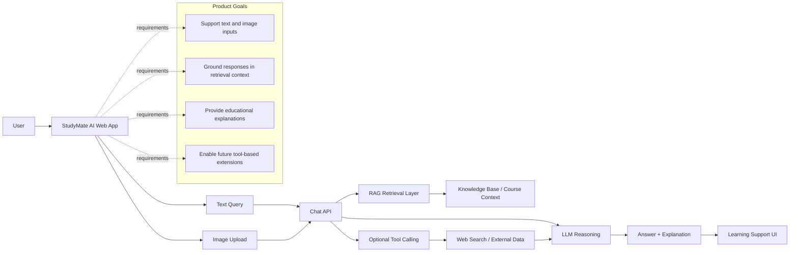
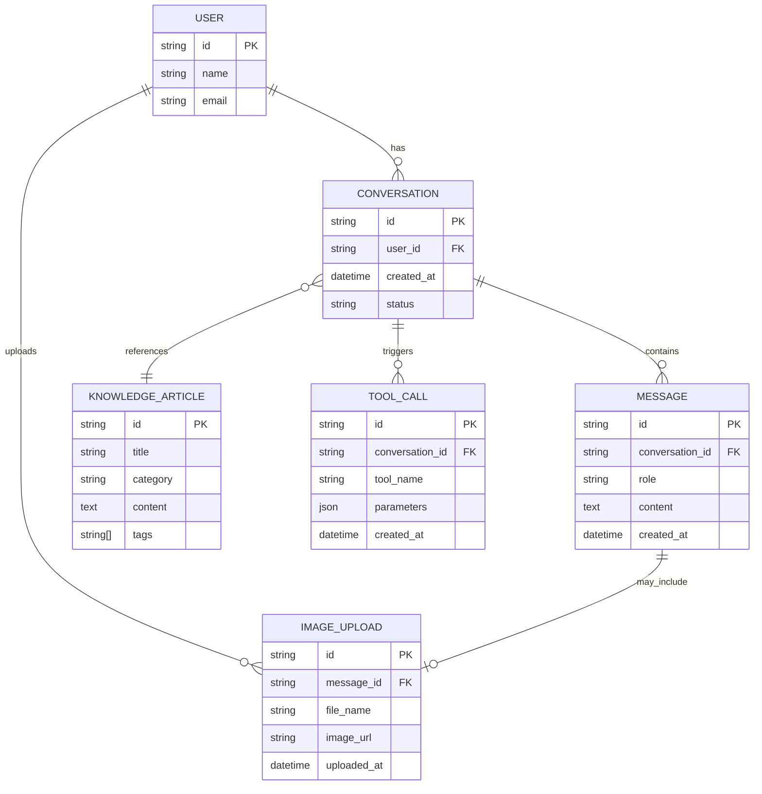

# StudyMate AI

StudyMate AI is a multimodal learning chatbot built with Next.js and the Vercel AI SDK. It supports text-based queries, image uploads, and RAG-style contextual grounding for educational responses.

## Features

- Text chat for questions and explanations
- Image upload support for diagrams, handwritten notes, and screenshots
- RAG-inspired knowledge retrieval using in-app learning context
- Groq-backed LLM responses via the Vercel AI SDK
- Optional tool-calling structure for future web search or external integrations
- Modern dark educational UI

## Tech Stack

- Next.js 16
- React 19
- TypeScript
- Tailwind CSS
- Vercel AI SDK
- Groq

## Local Setup

1. Install dependencies:

   ```bash
   npm install
   ```

2. Create a `.env.local` file in the project root and add your Groq API key:

   ```bash
   GROQ_API_KEY=your_groq_api_key_here
   ```

3. Run the app:

   ```bash
   npm run dev
   ```

4. Open http://localhost:3000 in the browser.

## Project Structure

- `app/page.tsx` — main chatbot interface
- `app/api/chat/route.ts` — Groq-powered chat route with RAG context and tool support
- `app/lib/rag.ts` — knowledge base and retrieval logic
- `app/globals.css` — app styling

## Demo Usage

Try prompts like:

- "Explain AI vs machine learning in simple terms"
- "Give me active recall techniques for exam revision"
- "Explain this diagram of a neural network"
- "Summarize how retrieval-augmented generation improves accuracy"

## Deployment on Vercel

1. Push the repository to GitHub.
2. Import the project into Vercel.
3. Add the environment variable:
   - `GROQ_API_KEY`
4. Deploy the project.

## Notes

This project is built to satisfy the assessment requirement for a multimodal chatbot with retrieval-aware responses and optional tool support. The app is ready to use locally and can be deployed to Vercel for a live demo.

## PRD Diagram



## ER Diagram



These diagrams represent the product flow and the conceptual data model for a multimodal study assistant.
